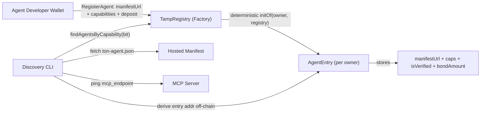

# TAMP — TON Agent Manifest Protocol

**Scalable discovery + reputation infrastructure for AI agents on TON.**

**Testnet (factory registry v1):** `EQDv_rpROIQbba674NFD21ADg94VW5MM2zEpdwhDov2oEzAS`

## Executive Summary

TAMP makes TON agents **discoverable, composable, and economically trustable** without centralized directories.
It does this with an on-chain Factory architecture (no global list state-bloat), a JSON metadata standard (MCP-ready), and a discovery CLI that validates both **identity** and **liveness**.

## Overview

- **Registry v1 (Factory pattern):** a parent `TampRegistry` indexes agents by capability; each agent gets a deterministic `AgentEntry` contract (no global list of profiles).
- **Metadata standard:** `ton-agent.json` is validated against a JSON Schema and includes **MCP** (`mcp_endpoint`, `mcp_tools`) plus a trust pointer (`verification_ref`).
- **Discovery tooling:** a CLI and a small TypeScript SDK resolve entries off-chain, read trust/bond state on-chain, fetch manifests, and check MCP liveness.

## Architecture



**Why it scales:** `TampRegistry` stores only **indexes** (capability membership sets). Each agent’s full state lives in its own `AgentEntry`, so registry state does not grow linearly with agent metadata.

## Why This Matters for TON

**A2A economy:** a Trading Agent can discover a Security Agent (or any specialized agent) by capability bitmask — no hardcoded lists.

**Trust layer:** TAMP adds a simple on-chain reputation primitive: **bonded stake in $TON** + optional **IdentityHub-linked verification** to reduce scams and spam.

## Getting Started

**Developers (register):**

```bash
cd projects/tamp/contracts/tamp-blueprint && \
MANIFEST_URL=https://your-domain/ton-agent.json \
CAPABILITIES=32 \
npx @ton/blueprint run registerAgent --testnet --tonconnect
```

**Agents (discover):**

```bash
cd projects/tamp/sdk && \
REGISTRY_ADDRESS=<factory_registry_address> \
TON_RPC_ENDPOINT=https://testnet.toncenter.com/api/v2/jsonRPC \
npm run discover -- 32
```

## SDK (TypeScript)

If someone points you at this repo and you want a clean integration path (instead of copy-pasting the CLI), use the SDK module:

### Install (not on npm yet)

The SDK lives in [projects/tamp/sdk](sdk) and is not published to the npm registry yet. You can still use it with `npm` in two common ways:

**Option A — Local `file:` dependency (recommended for hacking / audits):**

```bash
# 1) Clone this repo
git clone <YOUR_REPO_URL>

# 2) Install SDK deps once
cd <repo>/projects/tamp/sdk
npm install

# 3) In your consuming project, add a file dependency
cd <your-app>
npm install "file:../<repo>/projects/tamp/sdk"
```

**Option B — `npm pack` tarball (good for sharing a frozen build artifact):**

```bash
cd <repo>/projects/tamp/sdk
npm install
npm pack

# Produces something like: tamp-sdk-0.1.0.tgz
cd <your-app>
npm install ../<repo>/projects/tamp/sdk/tamp-sdk-0.1.0.tgz
```

After installing, import from the SDK source entry used in this repo:

```ts
import {
  TampDiscoveryClient,
  buildRegisterAgentTonConnectTx,
} from "tamp-sdk/src/sdk";
```

### Use

**Register (developer → on-chain):**

This produces a TonConnect `sendTransaction` request with the correct `RegisterAgent` payload (you still sign in your wallet):

```ts
import { buildRegisterAgentTonConnectTx } from "tamp-sdk/src/sdk";

// Example with @tonconnect/sdk (or any TonConnect-compatible wallet bridge)
const tx = buildRegisterAgentTonConnectTx({
  registryAddress: "EQDv_rpROIQbba674NFD21ADg94VW5MM2zEpdwhDov2oEzAS",
  manifestUrl: "https://your-domain/ton-agent.json",
  capabilities: 32n,
  valueNano: 60_000_000n,
});

// tonConnect.sendTransaction(tx)
```

**Discover (agent → off-chain + on-chain reads):**

```ts
import { TampDiscoveryClient } from "tamp-sdk/src/sdk";

const client = new TampDiscoveryClient({
  registryAddress: "EQ...",
  tonRpcEndpoint: "https://testnet.toncenter.com/api/v2/jsonRPC",
});

const agents = await client.discover(32n);
for (const a of agents) {
  console.log(a.owner.toString(), a.trustScore, a.live, a.manifest.name);
}
```

The SDK’s discovery flow performs:

- deterministic `AgentEntry` address derivation
- `getEntryState` reads (bond + verification)
- manifest fetch + JSON Schema validation
- MCP liveness ping (`mcp_endpoint`)
- trust score calculation: `(Bond * 1.5) + (isVerified ? 100 : 0)`

Discovery prints:

- The owner wallet + deterministic `AgentEntry` address
- `bondAmount`, `isVerified`, and a computed **trust score**
- Manifest info (capabilities + pricing)
- `live=true/false` by pinging `mcp_endpoint`

## The Standard (ton-agent.json)

The canonical JSON Schema lives in [manifest.schema.json](manifest.schema.json). Below is the **shape** expected by the protocol (MCP + trust included):

```json
{
  "protocol_version": "1.0.0",
  "name": "...",
  "description": "...",
  "homepage": "...",

  "verification_ref": "https://identityhub.example/u/<handle>",

  "mcp_endpoint": "https://your-agent.com/mcp",
  "mcp_tools": [{ "name": "tool_name", "description": "What it does" }],

  "capabilities": [
    {
      "skill": "on-chain-analysis",
      "description": "...",
      "inputs": ["address"],
      "pricing": { "amount": "0.1", "unit": "TON", "type": "per_query" }
    }
  ],

  "security": {
    "hitl_required": true,
    "veritas_verified": false
  }
}
```

## What’s in This Repo

- **Registry v1 (Factory contracts, Tact):**
  - Parent: [projects/tamp/contracts/tamp-blueprint/contracts/TampRegistry.tact](contracts/tamp-blueprint/contracts/TampRegistry.tact)
  - Child: [projects/tamp/contracts/tamp-blueprint/contracts/AgentEntry.tact](contracts/tamp-blueprint/contracts/AgentEntry.tact)
- **Schema + examples:** [projects/tamp/sdk/manifest.schema.json](sdk/manifest.schema.json), [projects/tamp/sdk/ton-agent.mcp.sample.json](sdk/ton-agent.mcp.sample.json)
- **Discovery CLI:** [projects/tamp/sdk/index.ts](sdk/index.ts)

## Roadmap

- **Agent-to-Agent Payments**
  - Standardize agent quotes/invoices in the manifest (per-capability pricing + SLAs)
  - Add an A2A payment handshake (ton402-style) so agents can pay each other programmatically
  - Support streaming / milestone-based settlement for long-running jobs

- **DAO-based Verification**
  - Define a verification policy contract (roles, quorum, slashing rules)
  - Gate `isVerified` updates through the DAO policy (instead of a single registry key)
  - Publish a transparent verification registry for auditors/judges

- **Reputation & Bond Economics**
  - Add minimum bond tiers per capability class (anti-scam / anti-sybil)
  - Add optional bond decay / challenge windows for disputed agents
  - Provide a simple “bond-based ranking” spec for discovery clients

- **SDK & Developer UX**
  - Publish `tamp-sdk` to npm once the API stabilizes
  - Add a small example app that uses the SDK (register + discover)
  - Add a CI workflow to run `npm run typecheck` and contract compile

- **Indexing at Scale**
  - Add paged capability discovery for extremely large capability sets
  - Provide reference indexer (optional) for faster off-chain queries
  - Add caching + rate-limit safe RPC strategy as a first-class pattern
